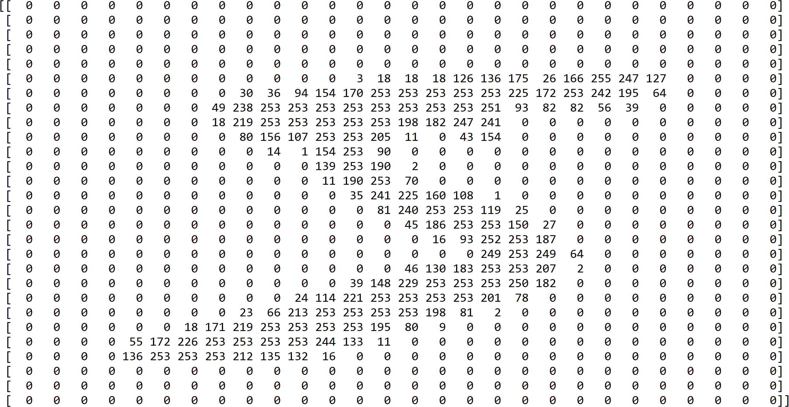
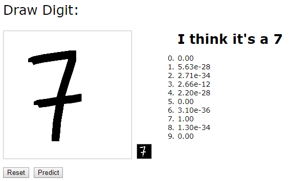

This is not an article about math (or maths as our European brethren like to call it) nor is it an exposition on the evils of a sentient AI that will kill us all in the end (I don't subscribe to things of that sort), the goal, dear reader, is to take you down the well trodden path of what this is all about: the software engineering process and what it currently looks like for AI and JavaScript.

Whenever we endeavor to create software we ask a million questions and write code that will solve the problem (including all of the edge cases). Consider the case where you are tasked to write a single function that given a double array of integers you are asked to return the number it most resembles.

To be completely precise, you are writing a function that recognizes digits. The array that you get looks something like this (we should return `5` in this case):



We've all had to write crappy code that this kind of task requires - the kind of code that we know is way too squishy and once we've pushed it to production we feel the need to take a shower (or something).

You and I can both feel the amount `if` statements and weird `for` loops we would have to write in order to create the necessary steps to write this function.

These types of tasks, however, happen to be the sweet spot for machine learning (a subfield of AI). The beauty of these techniques is that instead of coming up with a series of steps to solve the problem, we simply give the machine learning algorithms examples of the right thing (pictured below) and *it* will come up with the right steps - an algorithm if you will.


# The Process
While the main thrust of this article will not deal with how these algorithms work, it *is* important to know the basic process as well as the primary outputs that can be used in actual software (JavaScript in this case). Data Scientists usually go through a process that has roughly the following steps:
1. Define the problem (recognize digits)
2. Get some data (MNIST dataset)
3. Create good **model** (an abstaction of the actual function)
4. Give the model to someone to put into production

As developers we live somewhere between steps **3** and **4**.

# The Model
Usually these models are created using machine learning frameworks written in Python. Often it takes a *long* time to generate them and they require a lot of data. This part of the process is often tedious and frustrating. Once the tedious and frustrating part is done however, there is an actual *file* output that represents the model. You should think of this as an asset that you bring into your programs. In the case of TensorFlow the output is generally a protobuf file.

# TensorFlow.js
Now a word of caution, I don't consider myself a *modern* JavaScript expert so if I've done something wrong or there is a better way please do let me know. They key point of this section is showing you how to take a model and use it in a JavaScript application. In this case we will focus on using [TensorFlow.js](https://js.tensorflow.org/). While it is advertised as a framework for both training *and* deploying ML models, we will be focusing on the deployment portion given the fact that generally most models are created by data scientists using the full-strength TensorFlow python packages. Although I do admit there are some cases where doing transfer learning on the client sound amazingly interesting (more on that some other time).

The process for creating and converting a model to TensorFlow.js is fairly [simple](https://github.com/sethjuarez/tfjsmnist/blob/master/README.md) (I won't cover it here but it is a fun exercise and you should totally do it when you get a chance).

Now for the actual [application](https://tfjsmnist.azurewebsites.net/):



In this case I decided to use [vue.js](https://vuejs.org/) since I have some experience with the framework and there was already a [component](https://codepen.io/getflourish/pen/EyqxYE) out there that did most of the canvas drawing bit.

# The Code
There are two important parts when using the actual model:
1. Loading the model
2. Calling into the model

Let's look at each in turn.

## Loading the Model
Creating a vue component seemed like an awesome idea since I could load up the model once for the entire component and it would stay in memory. 

```javascript
    mounted: async function () {
        ... other things...

        // load model
        const MODEL = 'model/tensorflowjs_model.pb';
        const WEIGHTS = 'model/weights_manifest.json';
        this.model = await tf.loadFrozenModel(MODEL, WEIGHTS);
    }
```
I guess I could have chosen another point in the [instance lifecycle](https://vuejs.org/v2/guide/instance.html#Lifecycle-Diagram) but this seemed to work fine. Once `this.model` is all set up, it can be used whenever the **Predict** button is clicked. (Another interesting option is to predict everytime the mouse goes up!)

## Calling the Model
Now that we have an instance of the model this is how we call into it:

```javascript
    predict: async function() {
        const digit = this.getDigit();
        const d = tf.tensor1d(digit).reshape([1, digit.length]);
        this.probabilities = await this.model.execute({'x': d}).reshape([10]).data();
        this.prediction = this.probabilities.indexOf(Math.max(...this.probabilities));
    }
```
The `getDigit()` function gets the hand drawn image and does two things:
1. shrinks it down to a 28x28 image
2. gets the numerical array that we pass to the model.

The key call is `this.model.execute(...)`. This is where we pass in the actual array and the model does its work.

The result of this particular model is an array of size 10 that contains the probabilities for each digit. In other words, at index 0 of the array is the probability that it thinks the number is 0 (and so on).

# Some Final Thoughts
While this in no means is intended to be a thorough walkthrough for creating this application, it *is* intended to give you a sense for how machine learning models can be used in modern JavaScript applications with [TensorFlow.js](https://js.tensorflow.org/). 


To see everything in action you can try the live demo at [https://tfjsmnist.azurewebsites.net](https://tfjsmnist.azurewebsites.net/). **EVEN BETTER**: clone the [github repo](https://github.com/sethjuarez/tfjsmnist) and run it yourself!